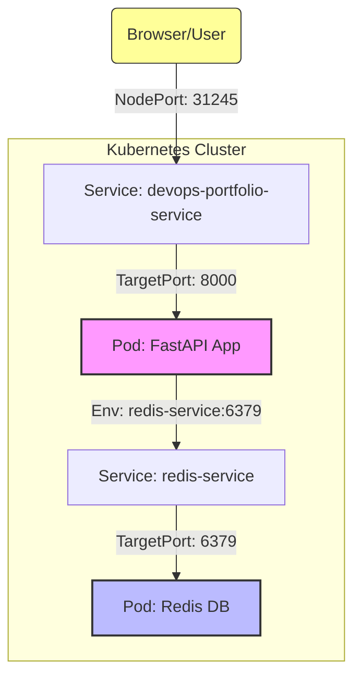

# 🚀 GitOps Project: Zero-Cost DevOps Portfolio


這是一個完整的 **GitOps 實作專案**，展示了從應用程式開發、容器化封裝，到自動化部署至 Kubernetes 的完整流程。本專案包含一個具備狀態 (Stateful) 的微服務應用，並透過 K8s 內部服務發現 (Service Discovery) 機制進行串接。

## 🏗️ 系統架構 (Architecture)

以下是目前部署在 Minikube 叢集中的微服務架構圖：



**運作流程：**
1.  **外部連線**：使用者透過瀏覽器存取 Minikube 的 NodePort (例如 `127.0.0.1:43537`)。
2.  **第一層轉發**：`devops-portfolio-service` 接收請求，導向 FastAPI Pod。
3.  **內部請求**：FastAPI App 執行邏輯，發現需要讀取資料。
4.  **服務發現**：App 透過環境變數 (`REDIS_HOST=redis-service`) 找到 Redis 的內部服務。
5.  **資料存取**：`redis-service` 將請求轉發給 Redis Pod 進行讀寫，最後回傳結果。

## 🛠️ 技術堆疊 (Tech Stack)

*   **Application**: Python 3.10, FastAPI (Async Web Framework)
*   **Database**: Redis (In-memory Data Store)
*   **Containerization**: Docker (Multi-stage Build)
*   **Orchestration**: Kubernetes (Minikube)
*   **CD / GitOps**: ArgoCD (Phase 4 Planned)

## 🚀 快速開始 (Quick Start)

### 前置需求
*   Docker Desktop
*   Minikube
*   Kubectl

### 部署步驟
1.  **啟動叢集**
    ```bash
    minikube start
    ```

2.  **一鍵部署 (App + Redis)**
    ```bash
    kubectl apply -f k8s/deploy.yaml
    ```

3.  **開啟服務頁面**
    ```bash
    minikube service devops-portfolio-service
    ```
    *(系統會自動開啟瀏覽器，或顯示網址供您複製)*

4.  **驗證功能**
    *   **首頁**: 確認 API 運作正常 (`{"message": ...}`)
    *   **計數器**: 存取 `/hits` 驗證 Redis 連線 (`{"hits": 1, ...}`)

## 📚 API 文件

| Method | Endpoint | Description | Status |
| :--- | :--- | :--- | :--- |
| `GET` | `/` | 回傳歡迎訊息 | ✅ Ready |
| `GET` | `/hits` | **(Stateful)** 存取 Redis 計數器並回傳造訪次數 | ✅ Ready |
| `GET` | `/health` | **(Health Check)** 檢查 Redis 連線狀態 | ✅ Ready |

## 📝 開發日誌

*   **Phase 1**: 環境建置 (Minikube, Kubectl) - ✅ 完成
*   **Phase 2**: App 開發 & Docker 封裝 - ✅ 完成
*   **Phase 3**: K8s Manifests & 服務串接 - ✅ 完成
*   **Phase 4**: ArgoCD 自動化部署 - 📅 待辦

---
**Author:** Dylan Chen
