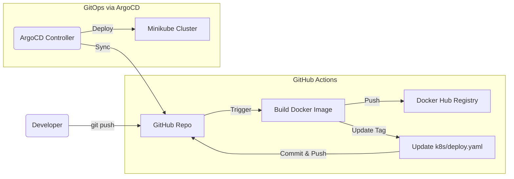
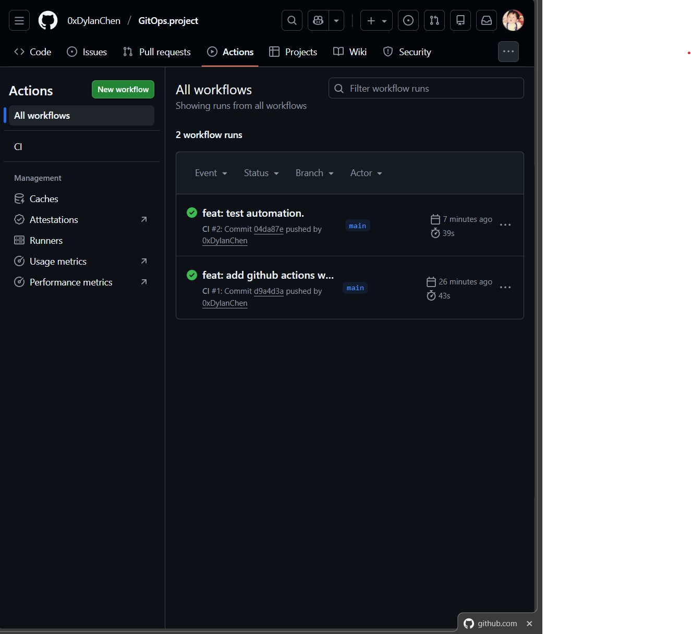
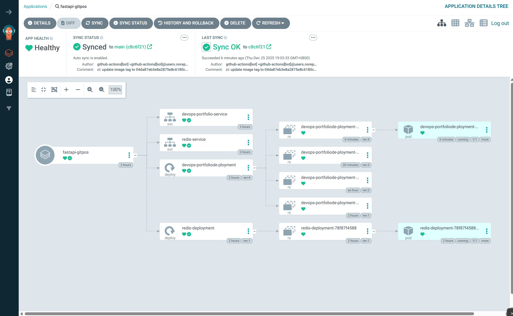
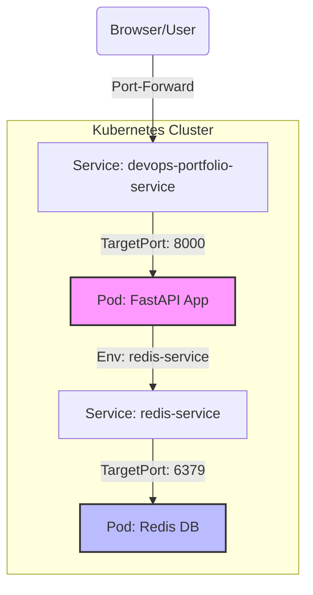
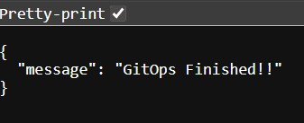

# 🚀 GitOps Project: Zero-Cost DevOps Portfolio


這是一個完整的 **GitOps 實作專案**，展示了從應用程式開發、容器化封裝，到 CI/CD 全自動化部署至 Kubernetes 的完整流程。本專案包含一個具備狀態 (Stateful) 的微服務應用，並透過 GitHub Actions 與 ArgoCD 實現「推送到部署」的無人值守自動化。

## 🏗️ 系統架構 (Architecture)

### 1. CI/CD & GitOps Pipeline (The Workflow)
這展示了當開發者 Push 程式碼後，系統如何自動運作：



#### 自動化實證 (Proof of Automation)
*   **GitHub Actions CI 執行成功：**
    

*   **ArgoCD 自動部署狀態 (Fully Synced)：**
    

### 2. 微服務架構 (Microservices)
部署在 Kubernetes 內部的應用程式結構：



## 🛠️ 技術堆疊 (Tech Stack)

*   **Application**: Python 3.10, FastAPI (Async Web Framework)
*   **Database**: Redis (In-memory Data Store)
*   **CI (Continuous Integration)**: GitHub Actions (Auto Build & Push)
*   **CD (Continuous Deployment)**: ArgoCD (GitOps Sync)
*   **Infrastructure**: Minikube (Local K8s), Docker Hub

## 🚀 如何運行 (How to Run)

由於本專案採用 GitOps 架構，你可以選擇「手動部署」或「體驗 GitOps 自動化」。

### 前置需求
*   Minikube & Kubectl
*   Docker Desktop

### 方式一：體驗全自動 GitOps (推薦)
1.  **啟動 Minikube**
    ```bash
    minikube start
    ```
2.  **安裝 ArgoCD** (若尚未安裝)
    ```bash
    kubectl create namespace argocd
    kubectl apply -n argocd -f https://raw.githubusercontent.com/argoproj/argo-cd/stable/manifests/install.yaml
    ```
3.  **連接 GitHub**
    在 ArgoCD 中建立 App，指向本儲存庫的 `k8s/` 目錄。
4.  **觸發更新**
    *   修改 `app.py` 程式碼。
    *   執行 `git push`。
    *   觀察 GitHub Actions 自動打包 -> ArgoCD 自動部署更新。

### 方式二：手動部署 (僅測試 App)
如果你不想設定 CI/CD，只想跑跑看程式：
```bash
# 直接部署 YAML
kubectl apply -f k8s/deploy.yaml

# 開啟通道連線
kubectl port-forward svc/devops-portfolio-service 8000:8000
```
瀏覽器打開 `http://localhost:8000` 即可看到結果。

## 📚 API 文件

| Method | Endpoint | Description | Status |
| :--- | :--- | :--- | :--- |
| `GET` | `/` | 回傳歡迎訊息 (會隨 GitOps 更新變動) | ✅ Ready |
| `GET` | `/hits` | **(Stateful)** 存取 Redis 計數器並回傳造訪次數 | ✅ Ready |
| `GET` | `/health` | **(Health Check)** 檢查 Redis 連線狀態 | ✅ Ready |

### 成果展示 (Live Demo)
以下是應用程式實際運行的畫面，顯示了與 Redis 連線後的計數功能：



## 📝 開發日誌

*   **Phase 1**: 環境建置 (Minikube, Kubectl) - ✅ 完成
*   **Phase 2**: App 開發 & Docker 封裝 - ✅ 完成
*   **Phase 3**: K8s Manifests & 服務串接 - ✅ 完成
*   **Phase 4**: ArgoCD & GitHub Actions 全自動化 - ✅ **已完成 (Fully Automated)**

---
**Author:** Dylan Chen